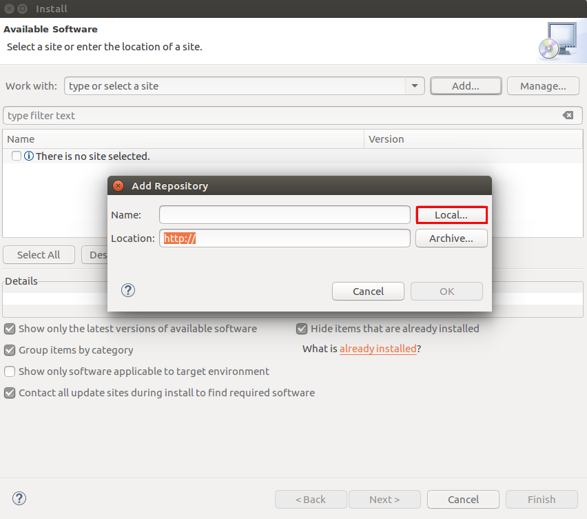
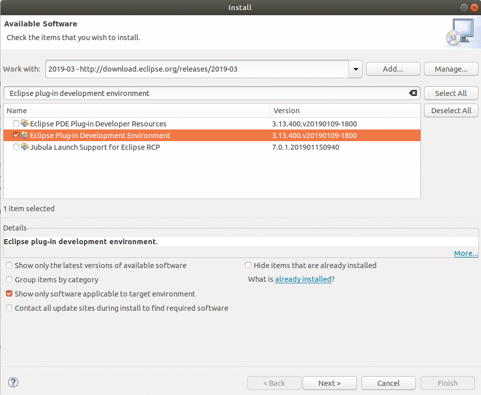

== Notes for developer

=== Public APIs

The server implementation currently gathers the most discussed bugs of a certain period of time (defaults to 30 days back).

The API is documented by using Swagger2:

http://217.172.12.199:9801/swagger-ui.html#/bugzilla-controller/getMostDiscussedBugsUsingGET

[[running-with-gradle]]
==== Running the Spring Boot server application

In order to run the Spring Boot application the following has to be run on the command line:

[source, console]
----
$ cd openreq/server
$ ./gradlew bRun
----

This can also be run from the IDE by using the Eclipse Buildship 2.x tooling (http://projects.eclipse.org/projects/tools.buildship/downloads) and Lombok (http://www.vogella.com/tutorials/Lombok/article.html#lombok-eclipse).

==== Generating p2 update site from source

You can also generate a p2 update site by cloning this repo and running the following command:

[source, console]
----
$ cd openreq/eclipse
$ ./mvnw clean verify
----

This will generate an update site for the Prioritizer Eclipse Plugin in the _openreq/eclipse/com.vogella.prioritizer.updatesite/target/repository_ folder.

Just press on the btn:[Local] and point to the update site folder.

This will list the required features, which have to be installed.

[[Eclise-Plugin-Running-From-IDE]]
==== Running the Eclipse Plugin from the IDE

Import all projects from the openreq git repository into your Eclipse IDE.

Then open the _target-platform.target_ file inside the _target-platform_ project with the target editor.
This will load all necessary dependencies for the project.
If you dont see the option to open the file with the target editor, 
install the Eclipse plug-in development environment feature first. 
Help -> Install New Software select your update site and filter with 'Eclipse plug-in development environment'.

Now open the _target-platform.target_ file with the target editor:

image::img/set_target_platform.png[]

[TIP]
====
In older Eclipse IDE distributions the _Reload Target Platform_ link was called _Set as Active Target Platform_.
====

After the target platform has been set the _Prioritizer-Plugin.launch_ launch configuration can be started by opening the _eclipse_ project and right clicking on the _Prioritizer-Plugin.launch_ file and clicking on the _Run as > Prioritizer-Plugin_ menu entry.

image::img/launch-file.png[]

[TIP]
====
The IP of the prioritizer service is hard coded in the class:
eclipse/com.vogella.prioritizer.service/src/com/vogella/prioritizer/service/PrioritizerServiceImpl.java 

You can change the IP of the Prioritizer API in the Run Configurations ... . 
Go to Arguments and enter the new IP Address here like this -serverUrl=http://217.172.12.111:9002. 
The arguments should now look like this:

-os ${target.os} -ws ${target.ws} -arch ${target.arch} -nl ${target.nl} -consoleLog -serverUrl=http://217.172.12.111:9002

====

=== Technologies

The following technologies are used:

* Spring Boot (-> http://www.vogella.com/tutorials/SpringBoot2/article.html)
* Lombok (-> http://www.vogella.com/tutorials/Lombok/article.html)
* Project Reactor IO (-> https://projectreactor.io/)
* Retrofit (-> http://www.vogella.com/tutorials/Retrofit/article.html)
* Gradle (-> http://www.vogella.com/tutorials/Gradle/article.html)
* Eclipse RCP (-> http://www.vogella.com/tutorials/EclipseRCP/article.html)
* Maven Tycho (-> http://www.vogella.com/tutorials/EclipseTycho/article.html)

=== Issues

Getting statistics from bugzillas rest api is quite hard and takes some time. Therefore I suggested some enhancements to bugzillas rest api:

* https://bugzilla.mozilla.org/show_bug.cgi?id=1440227

== How to contribute

See OpenReq project contribution link:https://github.com/OpenReqEU/OpenReq/blob/master/CONTRIBUTING.md[Guidlines]

== License

Free use of this software is granted under the terms of the EPL version 2 (EPL2.0).
