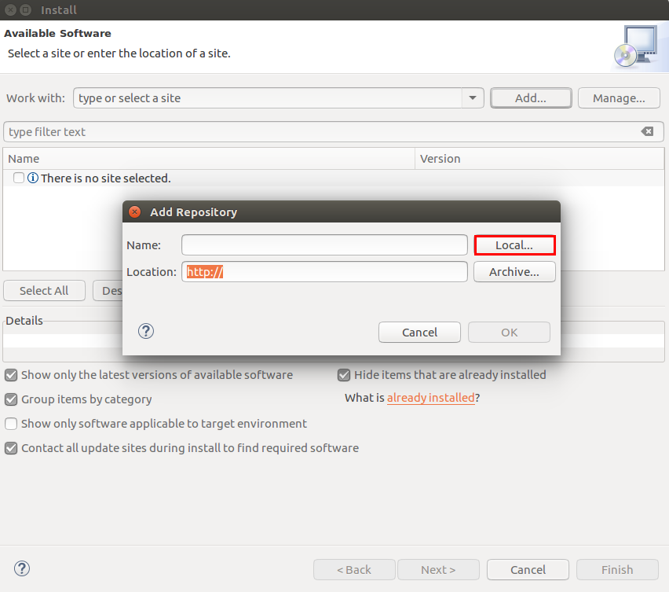
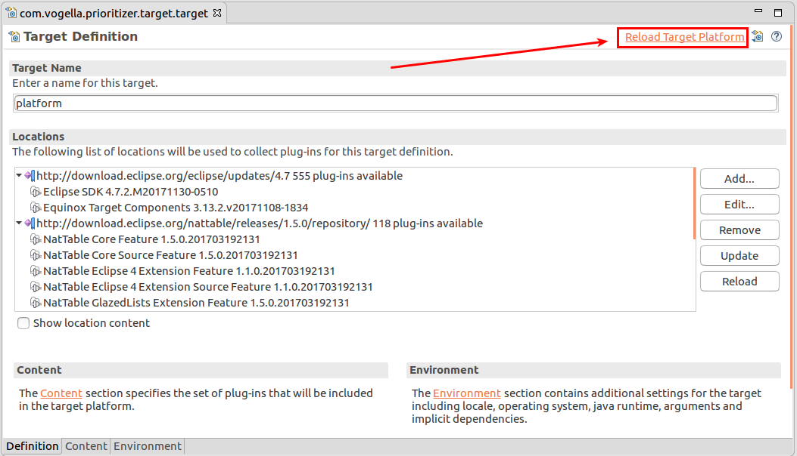
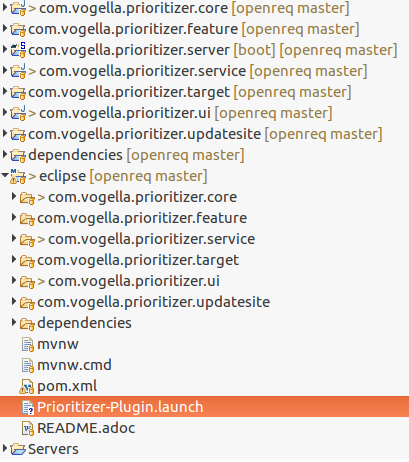

== OpenReq Prototype

The following technologies are used:

* Spring Boot (-> http://www.vogella.com/tutorials/Spring/article.html)
* Lombok (-> http://www.vogella.com/tutorials/Lombok/article.html)
* RxJava 2.x (-> http://www.vogella.com/tutorials/RxJava/article.html)
* Retrofit (-> http://www.vogella.com/tutorials/Retrofit/article.html)
* Gradle (-> http://www.vogella.com/tutorials/Gradle/article.html)
* Eclipse RCP (-> http://www.vogella.com/tutorials/EclipseRCP/article.html)
* Maven Tycho (-> http://www.vogella.com/tutorials/EclipseTycho/article.html)
* XChart (-> https://github.com/timmolter/xchart)

[[running-with-gradle]]
=== Running the Spring Boot application

In order to run the Spring Boot application the following has to be run on the command line:

[source, console]
----
$ cd openreq/server
$ ./gradlew bRun
----

This can also be run from the IDE by using the Eclipse Buildship 2.x tooling.

=== Installing the Eclipse Plugin

[TIP]
====
Since the Eclipse plug-in is under active development you should consider starting it from the Eclipse IDE.

See <<Eclise-Plugin-Running-From-IDE>>.
====

To install the Eclipse Plugin into the Eclipse IDE the following packages have to be installed:

* All features from the NatTable Update Site - http://download.eclipse.org/nattable/releases/1.5.0/repository/
* All features from the vogella OpenReq 3rd party dependencies - https://dl.bintray.com/vogellacompany/OpenReq-Eclipse/

Since the actual Eclipse plugin has not been released yet the update site has to be generated like this:

[source, console]
----
$ cd openreq/eclipse
$ ./mvnw clean verify
----

This will generate an update site for the Prioritizer Eclipse Plugin in the _openreq/eclipse/com.vogella.prioritizer.updatesite/target/repository_ folder.

Just press on the btn:[Local] and point to the update site folder.

This will list the required features, which have to be installed.

[[Eclise-Plugin-Running-From-IDE]]
=== Running the Eclipse Plugin from the IDE

Import all projects from the openreq git repository into your Eclipse IDE.

Then open the _com.vogella.prioritizer.target.target_ file inside the _com.vogella.prioritizer.target_ project.
This will load all necessary dependencies for the project.

[TIP]
====
In older Eclipse IDE distributions the _Reload Target Platform_ link was called _Set as Active Target Platform_.
====

After the target platform has been set the _Prioritizer-Plugin.launch_ launch configuration can be started by opening the _eclipse_ project and right clicking on the _Prioritizer-Plugin.launch_ file and clicking on the _Run as > Prioritizer-Plugin_ menu entry.

=== Using the Eclipse Prioritizer plug-in

=== What does the application currently do?

=== What's next?

