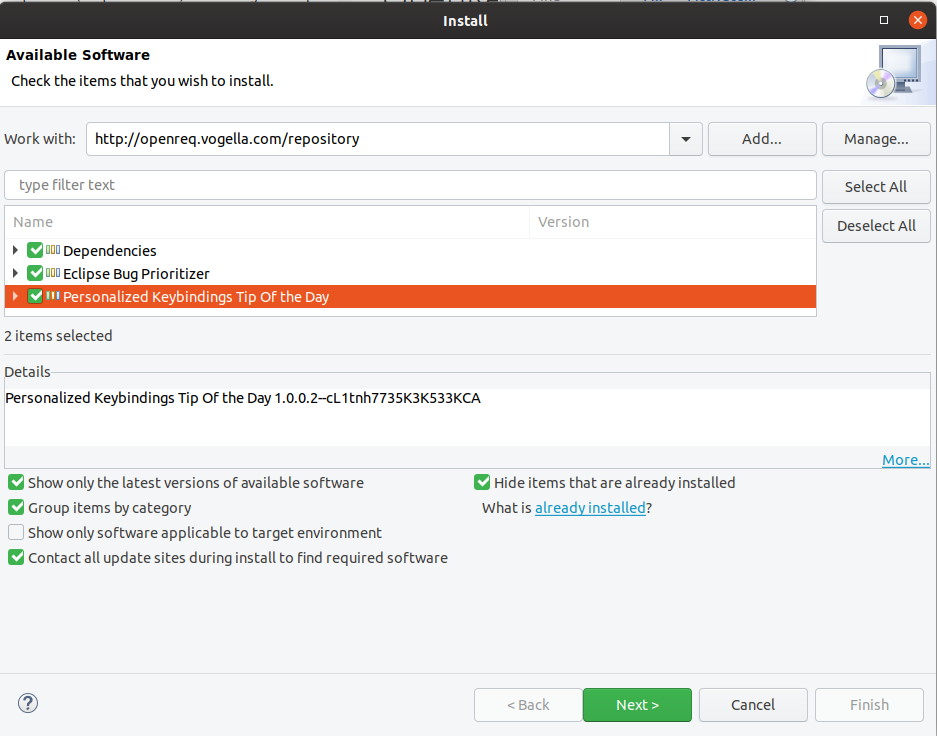
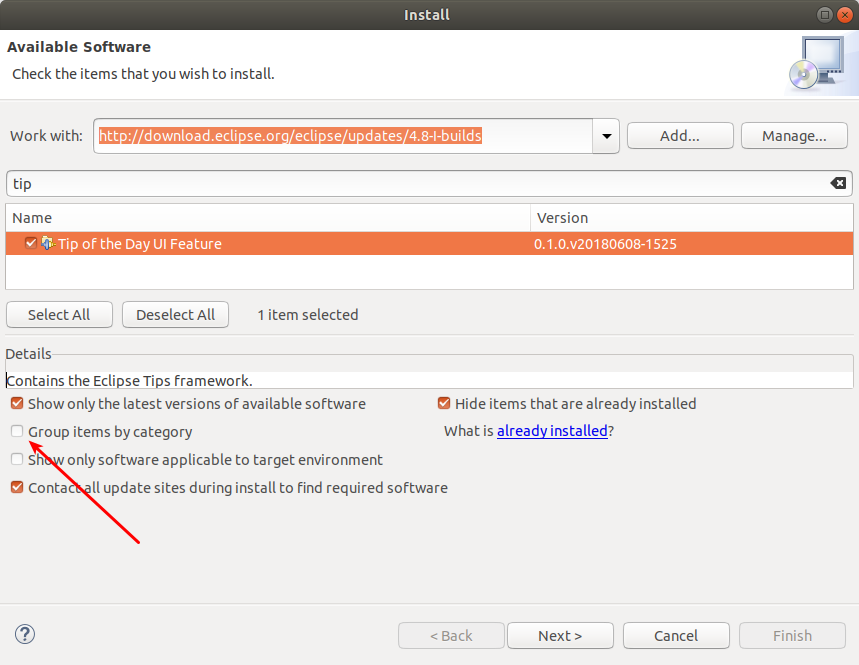
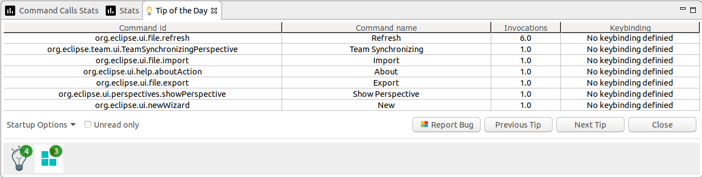
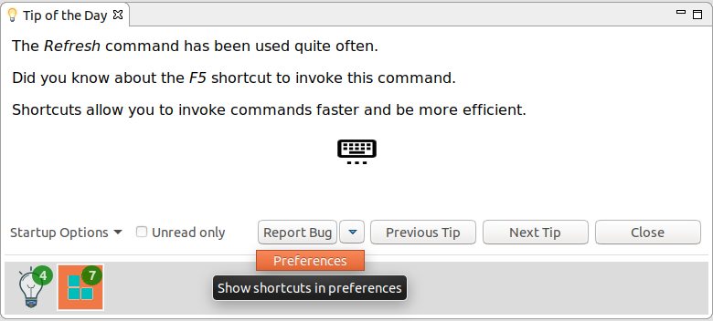
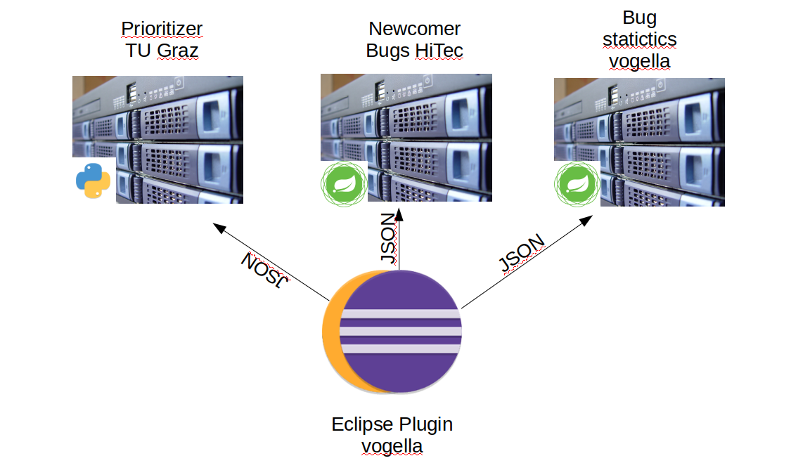

== OpenReq Eclipse Integration image:https://travis-ci.org/OpenReqEU/eclipse-plugin-vogella.svg?branch=master["Build Status", link="https://travis-ci.org/OpenReqEU/eclipse-plugin-vogella"] image:https://img.shields.io/badge/License-EPL%202.0-blue.svg["EPL 2.0", link="https://www.eclipse.org/legal/epl-2.0/"]

This plugin was created as a result of the OpenReq project funded by the European Union Horizon 2020 Research and Innovation programme under grant agreement No 732463.

The following technologies are used:

* Spring Boot (-> http://www.vogella.com/tutorials/SpringBoot2/article.html)
* Lombok (-> http://www.vogella.com/tutorials/Lombok/article.html)
* Project Reactor IO (-> https://projectreactor.io/)
* Retrofit (-> http://www.vogella.com/tutorials/Retrofit/article.html)
* Gradle (-> http://www.vogella.com/tutorials/Gradle/article.html)
* Eclipse RCP (-> http://www.vogella.com/tutorials/EclipseRCP/article.html)
* Maven Tycho (-> http://www.vogella.com/tutorials/EclipseTycho/article.html)

=== Public APIs

The server implementation currently gathers the most discussed bugs of a certain period of time (defaults to 30 days back).

The API is documented by using Swagger2:

http://217.172.12.199:9801/swagger-ui.html#/bugzilla-controller/getMostDiscussedBugsUsingGET

=== Functionalities of the Eclipse Plug-in

The Eclipse Plug-in offers the following features:

* Personalized prioritisation of requirements
* Newcomer bugs (work in progress)
* Most discussed bugs 
* Tip of the day with personalized tips for a better usage of the Eclipse IDE

As for the personalized prioritisation of requirements: The user can see directly in the Eclipse IDE, in the 'Prioritizer' View, which requirements would fit not only to his/her own interests but would also be of 
interest for the community and good for the Eclipse project. 
After the user enters his Email Address, Eclipse Project, and Components of interest, the user gets a personalized and prioritized list of bugs. 

As for the newcomer bugs: The user will see all bugs which are suitable for newcomers within the 'Prioritizer' view.

As for the most discussed bugs: Users will see the bugs with the largest amount of comments in the last 30 days for a specified Product - Component combination in the 'Most discussed bugs' view.

As for the Tip of the day with personalized tips: A service for the standard Eclipse Tip of the Day provides the user with personalized tips on how to improve his/her own usage of the Eclipse IDE.

=== Work in progress

* In the 'Prioritizer' view, the user can already remove bugs from his list by deleting or snoozing them. This functionality is not yet implemented on the server side. It will be available shortly.
* The newcomer bugs are not yet integrated to the 'Prioritizer' view.

=== Installing the Eclipse Plugin

A p2 update site can be found here: http://217.172.12.199/eclipse

This p2 update site can be entered in the following dialog by clicking menu:Help[Install New Software...].

=== Installing the Tip of the day feature

The user usage analysis is also provided as Tip of the day in the Eclipse IDE.

In order to install the _Tip of the day_ feature the _http://download.eclipse.org/eclipse/updates/4.8_ update site can be used.

 

[NOTE]
====
Make sure to uncheck the _Group items by category_ entry.
====

 

=== What does the application currently do?

In the Eclipse IDE you can install the Prioritzer plug-in and visualize the bugs, which might be interesting for you.

image::img/Prioritizer-View.png[]

The tracing plug-ins can also trace the usage of shortcuts in the IDE and give feedback about that by providing it as tip of the day.

For a single command:

 

Or as table for several commands:

 

=== What's next?

Further statistics will be provided.

=== Issues

Getting statistics from bugzillas rest api is quite hard and takes some time. Therefore I suggested some enhancements to bugzillas rest api:

* https://bugzilla.mozilla.org/show_bug.cgi?id=1440227

=== Technical structure

 

=== Notes for developer

[[running-with-gradle]]
==== Running the Spring Boot server application

In order to run the Spring Boot application the following has to be run on the command line:

[source, console]
----
$ cd openreq/server
$ ./gradlew bRun
----

This can also be run from the IDE by using the Eclipse Buildship 2.x tooling (http://projects.eclipse.org/projects/tools.buildship/downloads) and Lombok (http://www.vogella.com/tutorials/Lombok/article.html#lombok-eclipse).

==== Generating p2 update site from source

You can also generate a p2 update site by cloning this repo and running the following command:

[source, console]
----
$ cd openreq/eclipse
$ ./mvnw clean verify
----

This will generate an update site for the Prioritizer Eclipse Plugin in the _openreq/eclipse/com.vogella.prioritizer.updatesite/target/repository_ folder.

image::img/local_update_site.png[]

Just press on the btn:[Local] and point to the update site folder.

This will list the required features, which have to be installed.

[[Eclise-Plugin-Running-From-IDE]]
==== Running the Eclipse Plugin from the IDE

Import all projects from the openreq git repository into your Eclipse IDE.

Then open the _target-platform.target_ file inside the _target-platform_ project.
This will load all necessary dependencies for the project.

image::img/set_target_platform.png[]

[TIP]
====
In older Eclipse IDE distributions the _Reload Target Platform_ link was called _Set as Active Target Platform_.
====

After the target platform has been set the _Prioritizer-Plugin.launch_ launch configuration can be started by opening the _eclipse_ project and right clicking on the _Prioritizer-Plugin.launch_ file and clicking on the _Run as > Prioritizer-Plugin_ menu entry.

image::img/launch-file.png[]

[TIP]
====
The IP of the prioritizer service is hard coded in the class:
eclipse/com.vogella.prioritizer.service/src/com/vogella/prioritizer/service/PrioritizerServiceImpl.java 

You can change the IP of the Prioritizer API in the Run Configurations ... . 
Go to Arguments and enter the new IP Address here like this -serverUrl=http://217.172.12.199:9002. 
The arguments should now look like this:

-os ${target.os} -ws ${target.ws} -arch ${target.arch} -nl ${target.nl} -consoleLog -serverUrl=http://217.172.12.199:9002

The IP of the service running on ENG is: http://217.172.12.199:9002

The IP of the service running on TU Graz is: http://129.27.202.66:9002
====

=== Sources

http://bugzilla.readthedocs.io/en/latest/api/index.html

http://blog.florian-hopf.de/2016/04/learning-lucene.html

http://projectreactor.io/docs/core/release/reference/

https://sanaulla.info/2017/09/15/using-gmail-as-smtp-server-from-java-spring-boot-apps/

== How to contribute

See OpenReq project contribution link:[guidelines]

== License

Free use of this software is granted under the terms of the EPL version 2 (EPL2.0).

