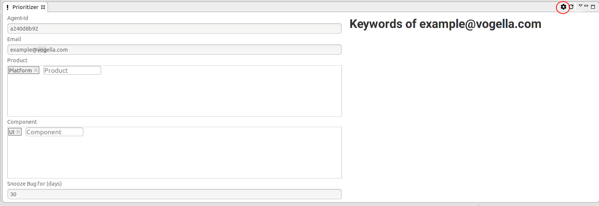
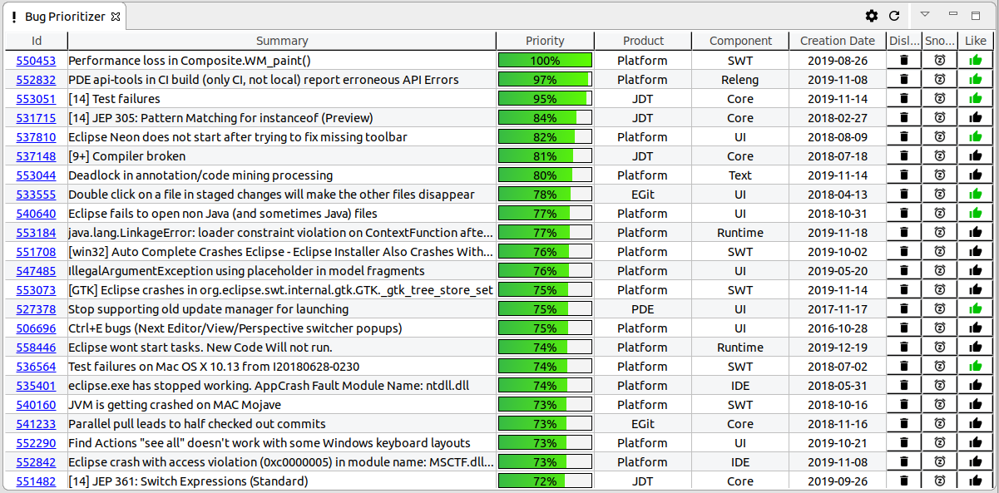
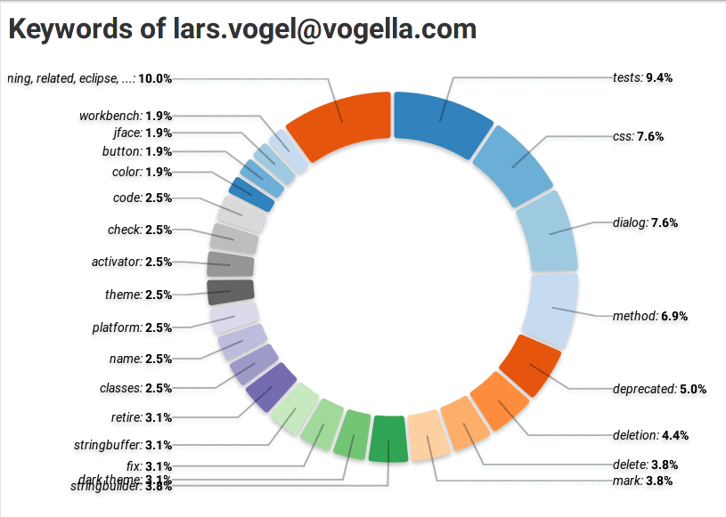
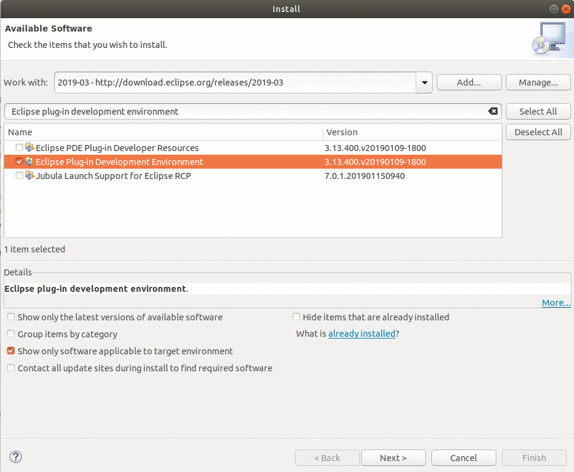

== OpenReq Eclipse Integration image:https://travis-ci.org/OpenReqEU/eclipse-plugin-vogella.svg?branch=master["Build Status", link="https://travis-ci.org/OpenReqEU/eclipse-plugin-vogella"] image:https://img.shields.io/badge/License-EPL%202.0-blue.svg["EPL 2.0", link="https://www.eclipse.org/legal/epl-2.0/"]

This plugin was created as a result of the OpenReq project funded by the European Union Horizon 2020 Research and Innovation programme under grant agreement No 732463.

=== Functionalities of the Eclipse Plug-in and how to use it

The Eclipse Plug-in offers the following features:

* Personalized prioritisation of requirements
* Most discussed bugs 
* Tip of the day with personalized tips for a better usage of the Eclipse IDE

As for the personalized prioritisation of requirements: The user can see directly in the Eclipse IDE, 
in the 'Bug Prioritizer' View, which requirements would fit not only to his/her own interests but would also be of 
interest for the community and good for the Eclipse project. 
After the user enters his Email Address, Eclipse Project, and Components of interest in the settings page, the user gets a personalized and prioritized list of bugs. 

The user can dislike, like and snooze bugs.
If a bug is disliked it will be deleted from his list and the algorithm will learn that this was not a good choice for the user.
If a bug is liked, this will help the algorithm to learn out of it and try to find similar bugs.
If a bug is snoozed, this would mean, that it was actually a good choice from the algorithm, but for the time being the user doesnt want to work on this bug and it will be shown again in x days.
The snooze period can be defined in the settings page.

The more the user likes and dislikes bugs, the better will become the results of the algorithm for the user.

If the user wants to reset his/her likes and dislikes, he/she would just need to change his/her Agent-ID.
The Agent-ID  in the settings page will initially be assigned to the user after installing the Plug-in, but it can be changed, as long as it is an alphanumeric value a-z, A-Z, 0-9 and has the length of 9.
If the user wants to use the Eclipse Plug-in from different computers he/she should make sure to only use one Agent-ID on every computer.

In the settings page the user can also see his keywords. 
This are words which where often found in bugs solved by the user in the past and will serve as one of the metrics to find suitable bugs for the user.

As for the most discussed bugs: Users will see the bugs with the largest amount of comments in the last 30 days for a specified Product - Component 
combination in the 'Most discussed bugs' view.

As for the Tip of the day with personalized tips: A service for the standard Eclipse Tip of the Day provides the user with 
personalized tips on how to improve his/her own usage of the Eclipse IDE.

For a single command within the standard Eclipse Tip of the Day:

image::img/tip-of-the-day-refresh-sample.png[] 

Or as table for several commands in the 'Tip of the Day' View:

image::img/tip-of-the-day-stats.png[] 

=== Installing the Eclipse Plugin

A p2 update site can be found here: https://api.openreq.eu/eclipse/

This p2 update site can be entered in the following dialog by clicking menu:Help[Install New Software...].

image::img/install-eclipse-plugins.png[]

=== Installing the Tip of the day feature

The user usage analysis is also provided as Tip of the day in the Eclipse IDE.

In order to install the _Tip of the day_ feature the _http://download.eclipse.org/eclipse/updates/4.8_ update site can be used.

image::img/install-tip-of-the-day.png[] 

[NOTE]
====
Make sure to uncheck the _Group items by category_ entry.
====

=== Notes for developer

=== Public APIs

The server implementation currently gathers the most discussed bugs of a certain period of time (defaults to 30 days back).

The API is documented by using Swagger2:

http://217.172.12.199:9801/swagger-ui.html#/bugzilla-controller/getMostDiscussedBugsUsingGET

[[running-with-gradle]]
==== Running the Spring Boot server application

In order to run the Spring Boot application the following has to be run on the command line:

[source, console]
----
$ cd openreq/server
$ ./gradlew bRun
----

This can also be run from the IDE by using the Eclipse Buildship 2.x tooling (http://projects.eclipse.org/projects/tools.buildship/downloads) and Lombok (http://www.vogella.com/tutorials/Lombok/article.html#lombok-eclipse).

==== Generating p2 update site from source

You can also generate a p2 update site by cloning this repo and running the following command:

[source, console]
----
$ cd openreq/eclipse
$ ./mvnw clean verify
----

This will generate an update site for the Prioritizer Eclipse Plugin in the _openreq/eclipse/com.vogella.prioritizer.updatesite/target/repository_ folder.

image::img/local_update_site.png[]

Just press on the btn:[Local] and point to the update site folder.

This will list the required features, which have to be installed.

[[Eclise-Plugin-Running-From-IDE]]
==== Running the Eclipse Plugin from the IDE

Import all projects from the openreq git repository into your Eclipse IDE.

Then open the _target-platform.target_ file inside the _target-platform_ project with the target editor.
This will load all necessary dependencies for the project.
If you dont see the option to open the file with the target editor, 
install the Eclipse plug-in development environment feature first. 
Help -> Install New Software select your update site and filter with 'Eclipse plug-in development environment'.

Now open the _target-platform.target_ file with the target editor:

image::img/set_target_platform.png[]

[TIP]
====
In older Eclipse IDE distributions the _Reload Target Platform_ link was called _Set as Active Target Platform_.
====

After the target platform has been set the _Prioritizer-Plugin.launch_ launch configuration can be started by opening the _eclipse_ project and right clicking on the _Prioritizer-Plugin.launch_ file and clicking on the _Run as > Prioritizer-Plugin_ menu entry.

image::img/launch-file.png[]

[TIP]
====
The IP of the prioritizer service is hard coded in the class:
eclipse/com.vogella.prioritizer.service/src/com/vogella/prioritizer/service/PrioritizerServiceImpl.java 

You can change the IP of the Prioritizer API in the Run Configurations ... . 
Go to Arguments and enter the new IP Address here like this -serverUrl=http://217.172.12.111:9002. 
The arguments should now look like this:

-os ${target.os} -ws ${target.ws} -arch ${target.arch} -nl ${target.nl} -consoleLog -serverUrl=http://217.172.12.111:9002

====

=== Technologies

The following technologies are used:

* Spring Boot (-> http://www.vogella.com/tutorials/SpringBoot2/article.html)
* Lombok (-> http://www.vogella.com/tutorials/Lombok/article.html)
* Project Reactor IO (-> https://projectreactor.io/)
* Retrofit (-> http://www.vogella.com/tutorials/Retrofit/article.html)
* Gradle (-> http://www.vogella.com/tutorials/Gradle/article.html)
* Eclipse RCP (-> http://www.vogella.com/tutorials/EclipseRCP/article.html)
* Maven Tycho (-> http://www.vogella.com/tutorials/EclipseTycho/article.html)

=== Issues

Getting statistics from bugzillas rest api is quite hard and takes some time. Therefore I suggested some enhancements to bugzillas rest api:

* https://bugzilla.mozilla.org/show_bug.cgi?id=1440227

== How to contribute

See OpenReq project contribution link:https://github.com/OpenReqEU/OpenReq/blob/master/CONTRIBUTING.md[Guidlines]

== License

Free use of this software is granted under the terms of the EPL version 2 (EPL2.0).

