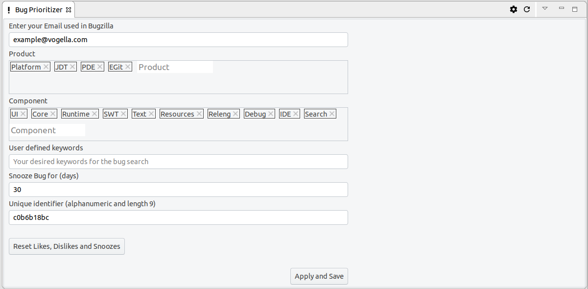

= OpenReq Eclipse Integration image:https://travis-ci.org/OpenReqEU/eclipse-plugin-vogella.svg?branch=master["Build Status", link="https://travis-ci.org/OpenReqEU/eclipse-plugin-vogella"] image:https://img.shields.io/badge/License-EPL%202.0-blue.svg["EPL 2.0", link="https://www.eclipse.org/legal/epl-2.0/"]

ifdef::env-github,env-browser[:outfilesuffix: .adoc]

This plugin was created as a result of the OpenReq project funded by the European Union Horizon 2020 Research and Innovation programme under grant agreement No 732463.

== Functionalities provided by this plug-in

The Eclipse Plug-in offers the following features:

* A view which shows bug reports and feature requests (requirements) from bugs.eclipse.org personalized for the current user
* A view which show the most discussed bugs in the last 30 days from bugs.eclipse.org
* Tip of the day extension with personalized tips for a better usage of the Eclipse IDE

== Installing the Eclipse Plugin

A p2 update site can be found here: https://api.openreq.eu/eclipse/

This p2 update site can be entered in the following dialog by clicking menu:Help[Install New Software...].

== Feature overview

=== Bug Prioritizer

As for the personalized prioritisation of requirements: The user can see directly in the Eclipse IDE, 
in the 'Bug Prioritizer' View, which requirements would be of interests for him and also in 
interest for the community and good for the Eclipse project. 
After the user enters his Email Address, Eclipse Project, and Components of interest in the settings page, the user gets a personalized and prioritized list of bugs. 

image::img/prioritizer_view.png[]

The user can dislike, like and snooze bugs.
If a bug is disliked it will be deleted from his list and the algorithm will learn that this was not a good choice for the user.
If a bug is liked, this will help the algorithm to learn out of it and try to find similar bugs.
If a bug is snoozed, this would mean, that it was actually a good choice from the algorithm, but for the time being the user doesnt want to work on this bug and it will be shown again in x days.
The snooze period can be defined in the settings page.

The more the user likes and dislikes bugs, the better will become the results of the algorithm for the user.

If the user wants to reset his/her likes and dislikes, he/she would just need to change his/her Agent-ID.
The Agent-ID  in the settings page will initially be assigned to the user after installing the Plug-in, but it can be changed, as long as it is an alphanumeric value a-z, A-Z, 0-9 and has the length of 9.
If the user wants to use the Eclipse Plug-in from different computers he/she should make sure to only use one Agent-ID on every computer.

In the settings page the user can also see his keywords. 
This are words which where often found in bugs solved by the user in the past and will serve as one of the metrics to find suitable bugs for the user.

image::img/keywords.png[]

=== Most discussed bugs

As for the most discussed bugs: Users will see the bugs with the largest amount of comments in the last 30 days for a specified Product - Component 
combination in the 'Most discussed bugs' view.

=== Tip of the day extension

As for the Tip of the day with personalized tips: A service for the standard Eclipse Tip of the Day provides the user with 
personalized tips on how to improve his/her own usage of the Eclipse IDE.

For a single command within the standard Eclipse Tip of the Day:

image::img/tip-of-the-day-refresh-sample.png[] 

Or as table for several commands in the 'Tip of the Day' View:

image::img/tip-of-the-day-stats.png[] 

== Notes for developers

See the DEVELOPER.adoc for information about how to build the plug-in.
